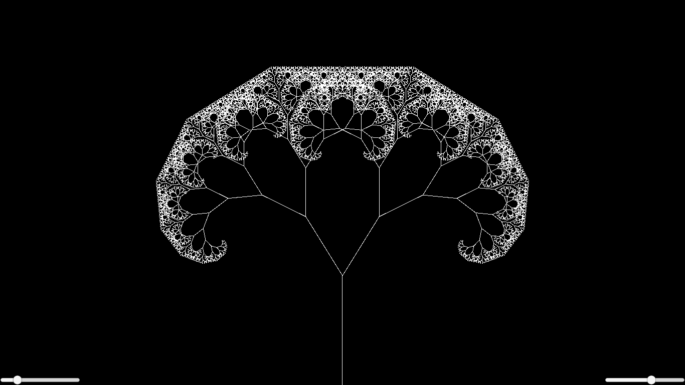

# Recursion Fractal Tree Unity
A simple program in Unity, which can create a fractal tree using recursion.

This neat little unity program can generate recursion trees where the user can set the initial branch length and the angle.

Inspiration: https://www.youtube.com/watch?v=0jjeOYMjmDU

# Example:

